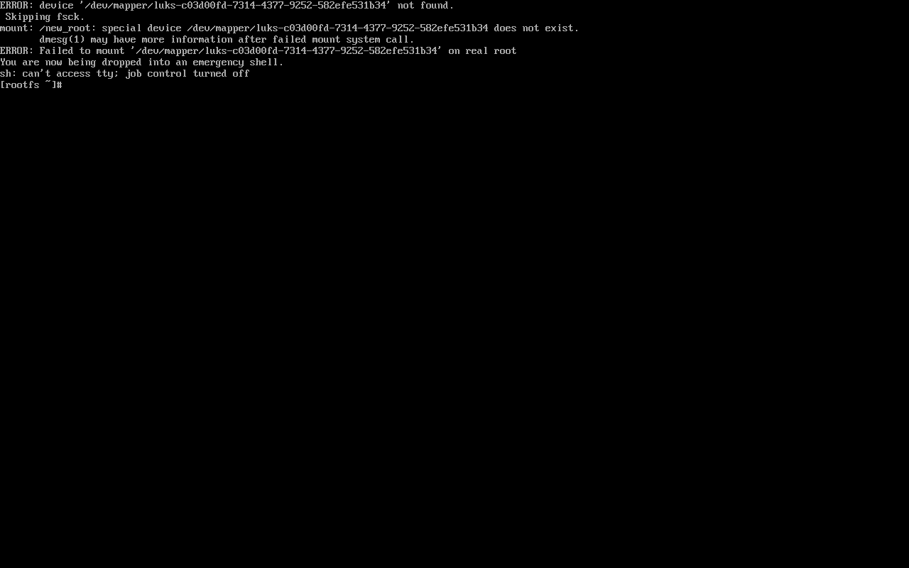
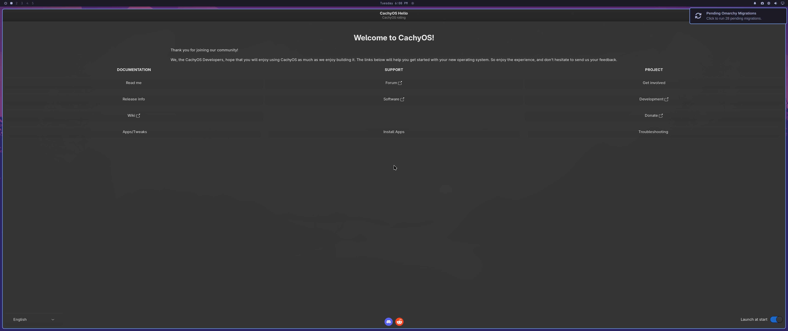

# VM upgrade path, 2026-08-18

Does this repo keep the promise `mroboff/omarchy-on-cachyos` does not — *upgrading
to a new CachyOS version and a new Omarchy version with no regressions*?

**Verdict: yes, and the failure it guards against is real.** The same upgrade —
Omarchy `4.0.0.r1046` → `4.0.0.r1744` with `linux-cachyos` 7.1.6 → 7.1.8 — was run
twice from an identical encrypted snapshot. Unguarded, the machine did not survive
the reboot: it dropped to an initramfs emergency shell, unable to unlock root.
Guarded by the ADR-0047 drop-in that `loaf install` writes, the identical upgrade
rebooted, unlocked, and came up with the desktop intact.

Everything below was observed. Where something was not observed, it says so.

## Summary

| | Result |
|---|---|
| An **encrypted** base carrying **r1046** | **Built** — the substrate the repo has never had |
| ADR-0047's premise, from the installer's source | **Confirmed** — CachyOS's Calamares writes `rd.luks.uuid=` |
| 1. Unguarded upgrade + reboot | **Strands the machine** (observed — emergency shell) |
| 1. Guarded upgrade + reboot | **Boots and unlocks** (observed) |
| 2. `loaf doctor` red in the pre-detonation window | **Passed** (observed, on a machine that still booted) |
| 2. `system-update`'s rendered-menu check | **Passed** — `26 of 26 … lack cryptdevice=`, exit 1 |
| 2. `loaf install`'s drop-in fixes it | **Passed** — correct UUID *and* mapper, menu re-rendered |
| 2. Negative proof (no drop-in + rebuild → no boot) | **Passed** (observed, via the real upgrade) |
| 3. Desktop after the upgrade | **No regressions** — bar, widgets and launcher render |
| 4. `loaf heal` re-asserts without hands | **Passed** — Omarchy's own post-update hook fired it |
| 4. `loaf doctor` ends green | **Passed** except `flatpaks`, blocked by a headless polkit |
| 4. `bash test/loaf-test.sh` | **122/122** (121 before installing `shellcheck` by hand) |

## The substrate

`docs/vm-validation-2026-08-18.md` stopped because the lab base had no encryption,
so ADR-0047's guard could only take its not-applicable branch. Building an
encrypted base carrying an *old* Omarchy was therefore the first job.

The sibling `luks-lab` lane had not yet published an `encrypted-base` snapshot when
this run started (it appeared at 16:08, two minutes before it would have been
needed), so this lane built its own rather than block.

**Own domain, own disk.** `shokupan-quattro-lab` was left alone — it was `suspend`ed
for the seven seconds of a `virsh vol-download`, then `resume`d, which is the only
way to get a byte-consistent copy of a qcow2 whose domain holds the qemu write
lock (`vol-clone` fails with `Failed to get shared "write" lock`, and it uses
`qemu-img convert`, which would drop the internal snapshots anyway). The copy was
uploaded back as `shokupan-upgrade-lab.qcow2` and a new domain defined on it. All
three of the original snapshots survived the round trip (`qemu-img check`: *No
errors were found*), and the copy was reverted to `quattro-layered` —
`omarchy-dev 4.0.0.r1046.gd570d99-1`, the pre-2026-08-14 pin.

**Two blockers from the previous run were removed, not worked around.**

- *No guest egress.* Rather than ask for the host `ufw` route rule, the domain got
  a second NIC using qemu user-mode networking (`<interface type='user'/>`)
  alongside the existing `default` bridge. The bridge keeps host↔guest SSH; the
  user-mode NIC carries a lower-metric default route and bypasses `ufw` entirely.
  Verified: `https via user-net: 200`.
- *No guest sudo password.* The CachyOS live ISO autologins `liveuser`, who is in
  `wheel` with `%wheel ALL=(ALL) NOPASSWD: ALL`. Krunner (`Alt+F2`) → Konsole,
  driven by `virsh send-key`, was enough to set a root password and install an SSH
  key; everything after that ran over SSH.

**LUKS was added in place**, from that live ISO, rather than by a fresh Calamares
run — which is what preserves the r1046 payload:

```
btrfs filesystem resize -32M /mnt/top
cryptsetup reencrypt --encrypt --type luks2 --reduce-device-size 32M \
  --pbkdf pbkdf2 --pbkdf-force-iterations 1000 --resilience none \
  --batch-mode --key-file /tmp/pw /dev/vda2
```

56 GiB encrypted in **1m09s**. The boot configuration was then rewritten into the
dialect the CachyOS installer emits (see the next section for why that exact
shape): `/etc/default/limine` gained `rd.luks.uuid=<uuid>` and
`root=/dev/mapper/luks-<uuid>`, and the base `/etc/mkinitcpio.conf` gained
`sd-encrypt`.

Finally — and this is the part that makes the substrate faithful — the initramfs
was built with `omarchy_hooks.conf` **temporarily moved aside**, then the file put
straight back. That reproduces the *pre-detonation window* exactly as ADR-0047
describes it: the hooks file on disk selects `encrypt`, the cmdline speaks only
`rd.luks.uuid=`, and the *running* image still contains `sd-encrypt`, so the
machine boots. It booted, prompted for the passphrase under
`systemd-cryptsetup`, and reached the Omarchy session
(`vm-upgrade-path-2026-08-18/00-luks-passphrase-prompt.png`).

The guide's own §6 spot-check, run on that machine, prints the line it is meant to
print:

```
DANGER: encrypt hook + LUKS root + no cryptdevice= - do not reboot
```

Snapshotted as `start-r1046`. Every run below begins there.

### What this substrate is not

It was **not produced by Calamares**. The disk layout, subvolumes, `/boot` as a
separate vfat, limine, snapper and the r1046 payload are all the original lab
base's; only the encryption and the LUKS half of the boot configuration were added
by hand. The `luks-lab` lane owns the from-blank-disk path. What is claimed here
is that the *inputs to ADR-0047's failure* are the real ones — and the next
section is why that claim is stronger than "it looks right".

## ADR-0047's premise, confirmed from the installer's source

ADR-0047 asserts that the CachyOS installer writes an sd-encrypt-style cmdline.
Until now that was an inference from one machine. The ISO used to build this lab
(`cachyos-desktop-linux-260628.iso`) carries Calamares, and its squashfs is
readable without root:

`usr/lib/calamares/modules/bootloader/main.py`:

```python
148: use_systemd_naming = have_program_in_target("dracut") or (
         ...target_env_call(["/usr/bin/grep", "-q", "^HOOKS.*systemd",
                             "/etc/mkinitcpio.conf"]) == 0)
...
172: if partition["mountPoint"] == "/" and has_luks:
173:     if use_systemd_naming:
174:         cryptdevice_params = [f"rd.luks.uuid={partition['luksUuid']}"]
175:     else:
176:         cryptdevice_params = [f"cryptdevice=UUID={...}:{...}"]
177:     cryptdevice_params.append(f"root=/dev/mapper/{partition['luksMapperName']}")
```

`usr/lib/calamares/modules/initcpiocfg/main.py` chooses the hooks that make
`use_systemd_naming` true in the first place:

```python
120: use_systemd = systemd_hook_allowed and target_env_call(["sh","-c","which systemd-cat"]) == 0
122: if use_systemd:
123:     hooks.insert(0, "systemd")
...
181: if encrypt_hook:
182:     if use_systemd:
183:         hooks.append("sd-encrypt")
184:     else:
185:         hooks.append("encrypt")
```

So on any CachyOS target with systemd present — i.e. all of them — the installer
writes `systemd` + `sd-encrypt` hooks **and** the `rd.luks.uuid=` cmdline, which is
precisely the pairing Omarchy's `omarchy_hooks.conf` later breaks. **ADR-0047's
premise is not machine-specific; it is what the installer is written to do.** The
mapper name this lab used, `luks-<uuid>`, matches both Calamares' convention and
the host machine's own `/dev/mapper/luks-cf6de841-…`.

This is worth adding to the upstream draft: the report can now cite the installer's
own source rather than one user's machine.

## 1. The upgrade, unguarded — it strands the machine

From `start-r1046`, `system-update` was run attended in a PTY (`tui-use`), answering
its `gum` confirmation and pacman's prompts as a human would. It offered exactly the
2026-08-14 upgrade:

```
omarchy-dev-4.0.0.r1744.gf002044-1     32.3 MiB
linux-cachyos-7.1.8-1-x86_64_v4        66.8 MiB
Total Download Size:   1492.02 MiB
```

The kernel bump is what forces the initramfs rebuild — the delayed detonation.
`system-update`'s own boot-contract check caught it immediately (see §2), and the
rebuilt image is unambiguous:

```
$ sudo lsinitcpio /boot/EFI/Linux/omarchy_linux-cachyos.efi | grep '^hooks/'
hooks/btrfs-overlayfs
hooks/encrypt          <-- busybox flavour
hooks/keymap
hooks/plymouth
hooks/udev
$ ... | grep -E 'systemd-cryptsetup'
(nothing)
```

`hooks/encrypt` present, `systemd-cryptsetup` gone, and the UKI's embedded cmdline
still carrying only `rd.luks.uuid=`. `omarchy-migrate` was then run, per
`docs/install-from-scratch.md`, and the machine rebooted.

It did not come back:

```
ERROR: device '/dev/mapper/luks-c03d00fd-7314-4377-9252-582efe531b34' not found.
 Skipping fsck.
mount: /new_root: special device /dev/mapper/luks-c03d00fd-… does not exist.
ERROR: Failed to mount '/dev/mapper/luks-c03d00fd-…' on real root
You are now being dropped into an emergency shell.
```



That is ADR-0047's `failed to load /dev/mapper/luks-cf6de841-…` reproduced, in a
VM, from the repo's own documented upgrade path. **This also is the brief's
negative proof** — no drop-in, an initramfs rebuild, and the guest genuinely fails
to boot — obtained from the real upgrade rather than a synthetic rebuild.

Snapshot: `detonated-unbooted`.

## 2. The guards fire before the damage

All three fire, in the order the repo intends.

**`loaf doctor`, in the pre-detonation window, on a machine that still boots:**

```
Base (CachyOS)
  ✓ kernel         7.1.6-1-cachyos
  ✗ boot contract  encrypt hook active but the running cmdline has no cryptdevice=
    the next initramfs rebuild will produce an image that cannot unlock root — the machine will not boot
    write /etc/limine-entry-tool.d/luks-cryptdevice.conf (see ADR-0047), then rebuild: …
```

Exit 1. This is the check the previous run could only reach vacuously.

**`system-update`'s rendered-menu verification**, in the unguarded run, right after
the pacman step:

```
Verify the boot menu can unlock LUKS
26 of 26 boot menu cmdlines lack cryptdevice= — do NOT reboot until fixed (ADR-0047)
…
Finished with problems in: boot-contract
```

and in the guarded run, on the identical upgrade:

```
Verify the boot menu can unlock LUKS
all 6 menu cmdline(s) carry cryptdevice=
…
Done
```

Its all-or-nothing rule (`cmdlines_ok == cmdlines_total`) was the obvious place to
expect a false positive, because `limine-snapper-sync` writes a `cmdline:` line per
snapshot entry and those are captured at snapshot time. It did not misfire: the
snapshot entries are regenerated from the current default cmdline, so after the
drop-in the count went 4 → 6 → 16 with **every** entry carrying `cryptdevice=`.

**`loaf install`'s drop-in step** wrote, unprompted:

```
Boot contract
  writing /etc/limine-entry-tool.d/luks-cryptdevice.conf for LUKS root c03d00fd-…
```

```
KERNEL_CMDLINE[default]+=" cryptdevice=UUID=c03d00fd-…:luks-c03d00fd-…"
```

Both halves are right: the UUID and, per ADR-0047's decision 1, the mapper name
read from the running `root=` rather than assumed. It then ran `limine-update`, and
4 of 4 menu cmdlines carried `cryptdevice=`.

**The guarded upgrade.** From `start-r1046` again, with only that drop-in added,
the identical `system-update` + `omarchy-migrate` ran and the machine was rebooted:

```
$ uname -r
7.1.8-1-cachyos
$ pacman -Q omarchy
omarchy-dev 4.0.0.r1744.gf002044-1
$ findmnt -n -o SOURCE /
/dev/mapper/luks-c03d00fd-7314-4377-9252-582efe531b34[/@]
$ loaf doctor | grep 'boot contract'
  ✓ boot contract  encrypt hook + cryptdevice= cmdline + drop-in agree
```

Same upgrade, same disk image, one drop-in apart: emergency shell versus a clean
boot. **Goal 1 holds.**

## 3. Desktop after the upgrade — no regressions

Session unlocked through SDDM, screenshots from the host framebuffer.



Compared against `.config/omarchy/shell.json` (read from the guest's own checkout
of `dotfiles-arch`, not the host's):

| shell.json | Rendered | Note |
|---|---|---|
| left: `shokupan.omenu` | ✅ power glyph |  |
| left: `omarchy.workspaces` | ✅ 1–5 | |
| centre: `indicators` (7 qml items) | — | all seven are conditional; none active in a fresh VM |
| centre: `austinkarren.clock` | ✅ `Tuesday 6:08 PM` | exactly `format: "dddd h:mm AP"` |
| centre: `omarchy.weather` | ✅ sun glyph |  |
| centre: `omarchy.system-update` | — | nothing pending; the machine had just updated |
| right: `omarchy.tray` | — | no tray clients running |
| right: `shokupan.notifications` | ✅ bell |  |
| right: `shokupan.apexshot` | ✅ camera | |
| right: `omarchy.bluetooth` | — | no Bluetooth device in the VM |
| right: `austinkarren.network` | ✅ globe | |
| right: `omarchy.audio` | ✅ speaker | |
| right: `omarchy.monitor` | ✅ display | |
| right: `omarchy.power` | — | no battery in the VM |

**Every difference is an absent input, not a broken widget.** The three widgets that
exist only in the plugins repo — `shokupan.omenu`, `shokupan.notifications`,
`shokupan.apexshot` — plus `austinkarren.clock` rendering in the rice's custom
format, are direct evidence that `loaf plugins` linked them and Quickshell loaded
them after the upgrade. This is the "bar widgets actually render" claim the previous
run could only check statically.

The launcher opens on `Super+Space`
(`vm-upgrade-path-2026-08-18/06-omarchy-menu.png`), and the app list
(`…/07-app-launcher.png`) leads with **Activity** and **Aether** — both rice-supplied
— while the debloated web apps are absent.

Two notifications appeared after the upgrade and are **not** explained by anything
here: `App failure — Command not found: "gnome-calendar"`, and a stale *28 pending
Omarchy migrations* toast (`omarchy-migrate --pending` reports none). Neither
affects the boot path or the bar.

## 4. `loaf heal` re-asserts without hands

ADR-0042's open claim was tested with upstream's own commands, not a synthetic edit.
`omarchy-refresh-applications` — which every update runs — put the debloated
launchers back:

```
✗ debloat        3 removed launcher(s) are back
```

Then `omarchy update` was run, and its post-update hook chain fired
`~/.config/omarchy/hooks/post-update.d/10-loaf-heal` **with no further input**:

```
Re-asserting the rice on top of the update...
Healing /home/austinkarren/dotfiles-arch
  → restored .config/omarchy/shell.json — upstream's version kept as shell.json.displaced.1787099253
  stow: nothing to do
  plugins: nothing to do
  → debloat: removed Basecamp
  → debloat: removed HEY
  → debloat: removed WhatsApp
  wallpapers: nothing to do
  migrations: none pending

4 change(s). Run loaf doctor to confirm.
```

The update had also overwritten **`shell.json` itself** — the file that defines the
bar layout §3 just verified — and heal put the rice's version back, preserving
upstream's alongside it. That is ADR-0028's premise and ADR-0042's remedy, both
observed in one pass.

**Final state**, after a second reboot:

```
Base (CachyOS)      ✓ repos ✓ mirrorlist ✓ wifi backend ✓ kernel 7.1.8-1-cachyos
                    ✓ boot contract  encrypt hook + cryptdevice= cmdline + drop-in agree
Desktop (Omarchy)   ✓ package omarchy 4.0.0.r1744.gf002044-1
                    ✓ version pin ✓ forks ✓ upstream refs ✓ debloat
Rice                ✓ symlinks 86 live ✓ plugins 7 linked ✓ bar widgets
                    ✓ leaks ✓ wallpapers ✓ git clean
Packages            ✓ manifest       all chosen packages installed
                    ✗ flatpaks       flatpak manifest and system disagree
Migrations          ✓ pending        none
```

The single remaining `✗` is an artefact of driving the machine over SSH:
`loaf flatpaks --install` reaches `error: Failed to install org.gnome.Platform:
Flatpak system operation Deploy not allowed for user` — a system-wide flatpak
install needs an interactive polkit agent. Nothing in this repo controls that.

```
$ bash test/loaf-test.sh
1..122
All 122 passed.
```

## Defects and observations

Ordered by how much they would cost someone following the guide. Items 1–3 are in
`dotfiles-arch`, not this repo, so they are reported rather than patched here.

1. **`loaf install`'s Packages step cannot run on a machine whose pacman database is
   older than the mirrors.** It calls `pacman -S --needed` with no preceding sync, so
   on the r1046 base every mirror 404'd on the exact versions the stale database
   named, and the install stopped:
   `error: failed retrieving file 'nodejs-26.4.0-2-x86_64_v4.pkg.tar.zst' … 404`
   ×2 packages ×10 mirrors → `✗ package install failed`. This is the normal state of
   any machine being brought up to date, which is exactly when the install path runs.
   A `-Syu` (or at minimum a database refresh) before the step would fix it.

2. **The boot-contract step sits behind the pin hard-stop.** `loaf install` orders
   its steps 1 base, 2 pin, 3 boot contract. On r1046 against an r1744 pin it exits
   at step 2 — so the machine most in need of the drop-in, one running an *older*
   Omarchy about to be upgraded, cannot get it without `--force`. Given §1, the
   drop-in is the cheapest and most irreversible-failure-preventing thing
   `loaf install` does; it would be safer ahead of the pin check.

3. **`loaf doctor` cannot say "drop-in written, reboot pending".** Between
   `loaf install` writing the drop-in and the next boot, doctor reads the *running*
   `/proc/cmdline`, finds no `cryptdevice=`, and prints the full red "the machine
   will not boot" text — with a remediation the user has just performed. It already
   reads `$CRYPT_DROPIN` in its other branch, so it has what it needs to distinguish
   the two. As it stands, a correct fresh install looks identical to an unguarded
   one until the reboot.

4. **`docs/install-from-scratch.md` §6's test count is unreachable by following the
   guide.** It says 122 on a complete machine and 121 without `shellcheck` — but
   `shellcheck` is not in `packages/chosen.packages` (verified: `grep -c` → 0) and
   nothing else installs it, so a machine built by following the guide always reports
   121. Installing it by hand gives 122. Patched in the following commit.

5. **The first `limine-update` after Omarchy is layered leaves a dead boot entry that
   is selected by default.** `omarchy-defaults.conf` sets `TARGET_OS_NAME="Omarchy"`
   and `omarchy-uki.conf` sets `ENABLE_UKI=yes`, so limine-entry-tool creates a *new*
   `Omarchy` OS entry with UKIs and abandons the installer's `CachyOS` one — while UKI
   generation deletes the duplicate `vmlinuz`/`initramfs` the abandoned entry still
   points at. The result boots to
   `PANIC: linux: Failed to open kernel with path 'boot():/…/linux-cachyos/vmlinuz'`
   with `default_entry: 2` aimed into the dead tree, and the eleven snapper snapshot
   entries were parented under it too. Recovered with
   `limine-remove-entry CachyOS 1` and `default_entry: 1`. On this lab base the UKIs
   had never been generated before, so this fires on the *first* `limine-update` after
   layering — the same moment a real install would hit it.

6. **`omarchy_hooks.conf` discards other drop-ins' hooks, observed directly.** The
   upstream draft calls this a "related smaller point"; the lab shows it plainly.
   `10-limine-snapper-sync.conf` contributes `HOOKS+=(sd-btrfs-overlayfs)`, and
   because `omarchy_hooks.conf` assigns `HOOKS=(…)` rather than appending, the built
   image contains `hooks/btrfs-overlayfs` and not `sd-btrfs-overlayfs` — on a machine
   whose snapshot-boot story depends on it.

7. **`omarchy-refresh-applications` fails outside a desktop session**, with
   `cp: cannot stat '/applications/*.desktop'` — it uses `$OMARCHY_PATH` unguarded,
   which only `env-bootstrap` sets. Upstream; noted because it makes the command
   useless in scripts and hooks.

8. **`system-update`'s final `loaf heal` step is silently skipped when `loaf` is not
   on `PATH`** (`if command -v loaf`). On a machine where the rice is cloned but not
   yet stowed — exactly the state §1 was run in — the update completes without the
   re-assertion the script's comment promises.

Not a defect, but recorded so nobody chases it: `omarchy update`'s snapshot step
prompted for a sudo password once, under a nested `script`/PTY, on a user with
`NOPASSWD: ALL`. It did not reproduce — `omarchy-snapshot create` and
`sudo -n snapper …` both succeed over plain SSH — and `omarchy-update` contains no
`sudo -k`.

## What was not tested

- **A from-blank-disk Calamares install.** That is `luks-lab`'s lane. This substrate
  was retrofitted; see "What this substrate is not".
- **`dotfiles-arch` at the r1046 era.** The rice was cloned at its current HEAD, so
  what was tested is *today's rice against the r1046→r1744 upgrade*, not the rice as
  it stood before 2026-08-14. This is the more useful direction — it is the rice
  someone would actually be running — but it is not a replay of the original day.
- **The stow-window hazard** (a re-link leaving Hyprland in config-error state).
  `loaf heal` never needed a stow pass here: `stow: nothing to do` on every run,
  because nothing displaced a stowed file. Neither confirmed nor ruled out.
- **Recovery from the emergency shell.** The unguarded failure was reproduced and
  snapshotted; recovering it by hand (adding `cryptdevice=` at the Limine prompt) was
  not attempted, because the guarded run demonstrates the outcome that matters.
- **`flatpaks` reaching green** — blocked by polkit under SSH, as above.

## Lab state

Domain **`shokupan-upgrade-lab`** (new, this lane's own; 60 GiB qcow2, LUKS
passphrase and lab account password both `lab`). Snapshots, in the order they were
taken:

| Snapshot | What it holds |
|---|---|
| `pre-detonation-r1046` | LUKS root, `rd.luks.uuid=` only, r1046, running initramfs still `sd-encrypt` |
| `start-r1046` | the above + `dotfiles-arch` cloned — every run starts here |
| `detonated-unbooted` | after the **unguarded** upgrade, before the reboot that strands it |
| `guarded-r1046` | `start-r1046` + the ADR-0047 drop-in |
| `guarded-upgraded-unbooted` | after the **guarded** upgrade, before the reboot |
| `guarded-upgraded-booted` | rebooted and unlocked under the `encrypt` hook |
| `rice-healthy` | rice installed and healed |
| `final-verified` | rebooted twice, doctor green but `flatpaks`, suite 122/122 |

Untouched, as required:

- **`shokupan-quattro-lab`** — its three snapshots (`base-cachyos`,
  `quattro-layered`, `pre-vm-validation-2026-08-18`) are intact, and it is running,
  as it was found. It was suspended for seven seconds during the disk copy.
- **`shokupan-luks-lab`** — the sibling lane's domain, never opened.
- **Host** — nothing installed, no host root, no firewall rule, no change to the
  live desktop or `~/dotfiles-arch`. Guest egress came from qemu user-mode
  networking instead.
